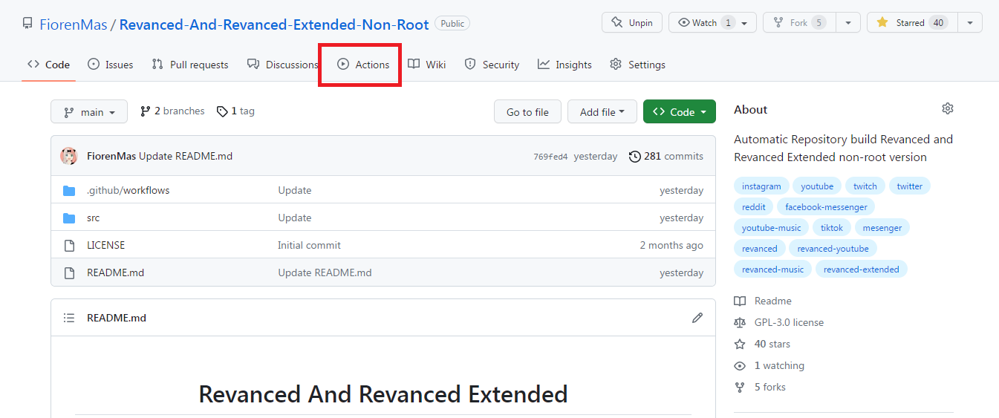
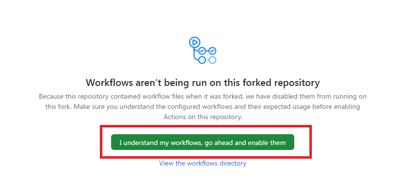
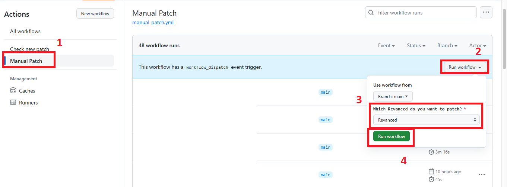

<h1 align="center">
  <br>
      Frequently Asked Questions
  <br>
</h1>

### Q: I'm facing a playback issue (video stops loading after 10-30s). How can I fix it?

The issue might be that your Android OS is preventing MicroG (GMS Core) from running in the background. Follow these instructions to resolve the problem.

[https://dontkillmyapp.com/](https://dontkillmyapp.com/)

---

### Q: How do I use this repository for patching my own build?

[Fork](https://github.com/ahmedhesham2626/YouTube-Morphe/fork) the repository, then go to the `Actions` tab.


Click "I understand my workflows, go ahead and enable them".


Follow these steps to run the "Manual Patch" workflow.


Once it finishes, download your patched APK from the release listed in the README.

---

### Q: I want to change which patches are applied. How can I do it?

Open [`src/patches/`](../src/patches). It contains one folder per app (`youtube-morphe`, `youtube-music-morphe`), each with two files: `exclude-patches` and `include-patches`. Add one patch name per line, following the available patches list here:

* [Morphe patches](https://github.com/MorpheApp/morphe-patches)

---

### Q: I want to change patch options (branding, package name, etc). How can I do it?

Open [`src/options/`](../src/options). Each file is a JSON array of patch bundles, where each entry enables a patch by name and sets its options. For example, to rename YouTube and give it a custom icon:

```json
[
  {
    "patches": {
      "Custom branding": {
        "enabled": true,
        "options": {
          "customName": "YouTube Morphe",
          "customIcon": "src/branding/youtube-morphe-black"
        }
      }
    }
  }
]
```

`morphe-black.json` and `morphe-white.json` are the options files actually used by the two YouTube builds; `morphe.json` is used by the YouTube Music build. See `src/build/morphe.sh` for which options file each build reads.

---

### Q: I am facing errors using these apps, what do I do?

This repository only patches apps using the Morphe patches project — it doesn't write the patches themselves. If you hit an error, please open an issue on [MorpheApp/morphe-patches](https://github.com/MorpheApp/morphe-patches/issues) rather than here, unless you suspect the problem is specific to this build setup.

---

### Q: How do I know these apps are safe to use?

The build code here is fully open-source and runs through GitHub Actions, so you can inspect exactly what happens at every step. The original YouTube/YouTube Music APKs used as a patching base are downloaded from a trusted source.

---
